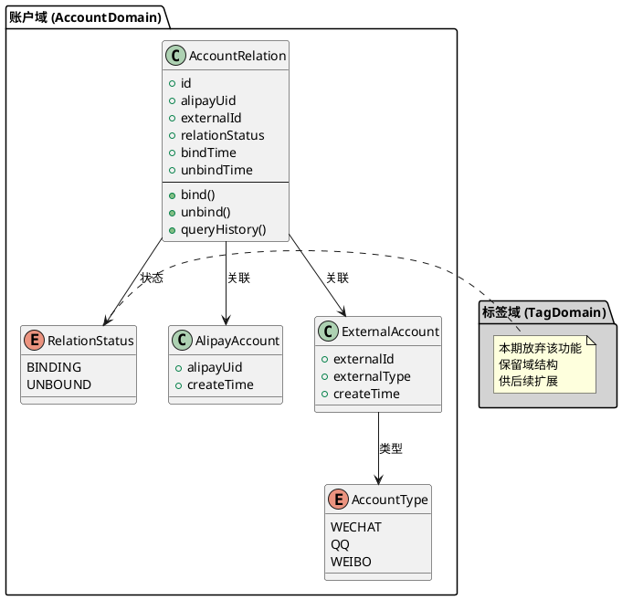
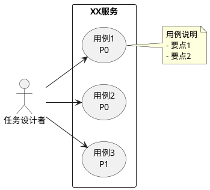
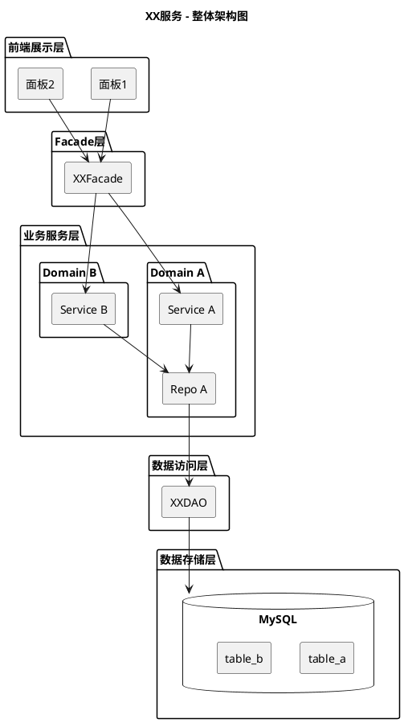
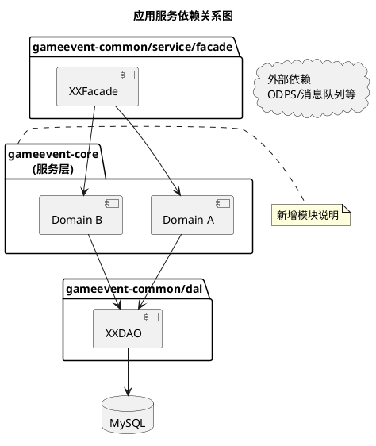
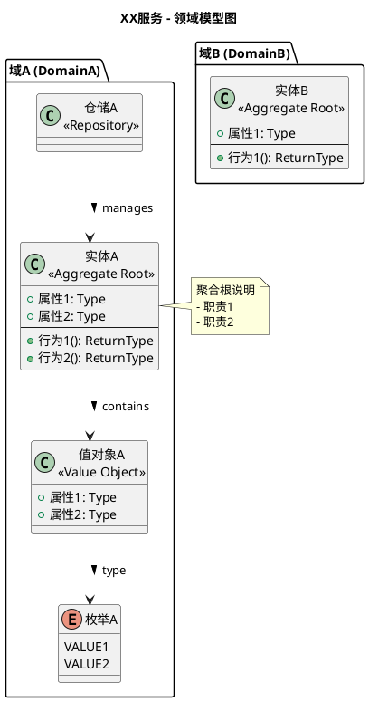
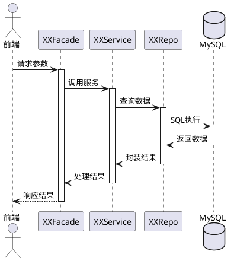
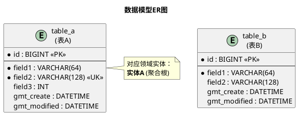

# 系统分析文档编写助手

本技能帮助用户通过对话形式逐步完成高质量的系统分析文档。整个过程遵循结构化的方法论，确保文档的完整性、合理性和可实施性。

## 技能目标
- 引导用户完成完整的系统分析文档编写过程
- 通过对话澄清不确定的需求和技术细节
- 应用标准化的评审机制确保文档质量
- 生成符合标准的系统分析文档

## 工作流程

### 第一步：确认系分模板
1. 向用户展示默认的系分文档模板
2. 询问用户是否要使用默认模板，或者上传自定义模板
3. 如果用户选择自定义模板，请用户提供模板内容或路径

### 第二步：需求确认
1. 通过多轮对话收集需求细节
2. 遇到不明确的术语、需求背景时，主动向用户确认
3. 持续询问直至收集到足够信息来编写系分文档
4. 记录所有关键假设和业务背景

### 第三步：系分文档撰写
1. 根据收集的信息开始撰写文档各部分
2. 对于不清楚的部分，主动向用户询问确认
3. 如有需要，向用户索要核心代码库信息和项目历史文档
4. 针对关键技术方案与用户讨论，并记录讨论过程和结论在"关键技术"部分
5. 确保文档逻辑完整且技术方案可行

### 第四步：文档质量自评
对生成的系分文档进行自动化质量评估，涵盖六个维度（总计100分）：
- 完整性 (Completeness): 20%
- 合理性 (Reasonableness): 25%
- 逻辑完整性 (Logical Integrity): 15%
- 可实施性 (Implementability): 20%
- 图表质量 (Diagram Quality): 10%
- 标准化 (Standardization): 10%

评估结果需体现在文档中，指出优点和待改进之处。

### 第五步：文档修订
1. 输出初版系分文档（Markdown格式）
2. 询问用户是否满足要求
3. 根据用户反馈进行相应修改
4. 直至用户满意为止

## 质量控制要点

### 需求澄清
- 对任何不明确的技术术语必须向用户确认
- 对需求背景、业务逻辑有疑问时必须向用户核实
- 不得自行猜测或搜索资料代替用户确认

### 技术方案讨论
- 关键技术选型需要与用户讨论优缺点
- 复杂架构方案需要记录权衡考虑因素
- 性能、扩展性、安全性的考虑必须体现在文档中

### 文档结构
标准系分文档应包括但不限于：
- 需求背景与目标
- 系统架构设计
- 技术方案选型
- 数据流与接口设计
- 安全考虑
- 性能优化策略
- 部署方案
- 风险评估与应对

## 默认系分文档模板

基于领域驱动设计（DDD）思想的标准系统分析文档模板，使用PlantUML生成可视化图表。

```markdown
# 系分文档模板（PlantUML版）

## 核心原则：领域建模思维（DDD）

### 从用户用例到领域模型的推导方法

领域建模思维路径：

```
┌─────────────────────────────────────────────────────────────────┐
│                     领域建模思维路径                              │
├─────────────────────────────────────────────────────────────────┤
│                                                                 │
│   用户用例分析          领域模型推导           技术实现           │
│   ━━━━━━━━━━          ━━━━━━━━━━━           ━━━━━━━━           │
│                                                                 │
│   1. 识别参与者         →  定义领域实体        →  实体类设计      │
│   2. 梳理业务流程       →  划分领域边界        →  包/模块划分     │
│   3. 提取业务规则       →  建立领域关系        →  关联/聚合设计   │
│   4. 抽象业务操作       →  定义领域服务        →  Service层设计   │
│   5. 识别不变量         →  确定值对象          →  Value Object   │
│                                                                 │
└─────────────────────────────────────────────────────────────────┘
```

### 用户用例 → 领域模型推导示例

**以"企微外域账户管理"为例：**

#### Step 1: 用户用例分析（第2章 业务架构）

| 场景 | 用例描述 | 业务规则 |
|------|---------|---------|
| 绑定企微 | 用户将支付宝账号与微信账号绑定 | 1. 一个支付宝账号只能绑定一个微信账号<br/>2. 需验证微信身份 |
| 解绑企微 | 用户解除支付宝与微信的绑定关系 | 1. 绑定时才能解绑<br/>2. 保留绑定历史 |
| 查询绑定 | 用户查询当前绑定状态和历史 | 1. 展示最新绑定关系<br/>2. 可追溯历史记录 |

#### Step 2: 领域模型推导（第3.4节）

从用例中提取领域概念：

```
用例中的概念          领域实体/值对象
━━━━━━━━━━━━━━       ━━━━━━━━━━━━━━━━━
支付宝账号     →      AlipayAccount（实体）
微信账号       →      ExternalAccount（实体）
绑定关系       →      AccountRelation（实体）
账号类型       →      AccountType（枚举/值对象）
绑定状态       →      RelationStatus（枚举/值对象）
```

**领域模型图 - PlantUML：**



#### Step 3: 领域模型到代码实现映射

```
领域层概念              代码实现层
━━━━━━━━━━━            ━━━━━━━━━━━━━
领域实体               DO/Entity 类
领域服务               Service 接口+实现
仓储接口               Repository 接口
领域事件               Event 类
值对象                 VO/DTO 类
```

---

## 文档结构

### 1. 文档头部
- **项目名称**：文档标题
- **文档修订历史**：版本、作者、修改内容、日期

### 2. 概述（第1章）
#### 1.1 术语
- 术语名称 | 术语描述 的表格

#### 1.2 需求背景
- 项目产生的业务背景说明
- 当前痛点/问题描述

#### 1.3 目标
##### 业务目标
- 短期目标（时间节点 + 关键指标）
- 长期目标（时间节点 + 关键指标）
- 使用加粗强调核心指标

##### 产品目标
- 一句话总结核心功能
- 使用**加粗**强调核心能力
- 功能点列表（可用删除线标记放弃的功能）

#### 1.4 项目资料&协同人员
| 分类 | 协同人员 | 链接 |
| DIMA | | |
| MRD | 姓名 | 链接 |
| PRD | 姓名 | 链接 |
| 视觉稿 | | |
| 后端 | 姓名 | |
| 前端 | 姓名 | |
| 测分 | 姓名 | |
| PM | 姓名 | |

---

### 3. 业务架构分析与设计（第2章 - 用例分析）
#### 3.1 业务需求分析
| 场景 | 用例描述 | 业务规则 |
|------|---------|---------|
| 场景名称 | 流程/描述 | 规则1<br/>规则2 |

**要点**：用例分析是领域建模的输入，重点识别：
- **参与者**（用户/系统/外部服务）
- **核心业务概念**
- **业务规则和约束**
- **状态变化**

#### 3.2 用户动线
- 可引用其他文档

#### 3.3 业务用例（PlantUML）



---

### 4. 服务架构和领域模型（第3章 - 核心）
#### 4.1 服务整体架构（PlantUML）



#### 4.2 关键技术及第三方框架依赖
- 方案对比表格
- 对比维度：方案说明、业务满足度、成本、优点、缺点、方案选型

#### 4.3 应用服务依赖关系（PlantUML）



#### 4.4 服务领域模型 ⚠️【关键章节】

**编写原则**：
1. **基于用例推导**：每个领域概念都应在用例中能找到出处
2. **职责清晰**：每个领域/实体只负责一类相关的业务逻辑
3. **边界明确**：明确哪些属于本域，哪些属于外部域

**标准格式**：

```markdown
**XX域**：

+ 职责：
    - 职责1（对应用例X场景Y）
    - 职责2（对应用例X场景Z）
+ 实体：
    - 实体A：属性、行为
    - 实体B：属性、行为
```

**领域模型关系图（PlantUML）：**



---

### 5. 业务边界分析（第4章）
#### 5.1 服务交互分析（PlantUML时序图）



#### 5.2 对外接口协议
- 接口名称 + OneAPI链接

---

### 6. 数据与配置设计（第5章）
- 新增数据表说明
- 数据表结构图或描述

**数据表ER图（PlantUML）：**



**与领域模型的关系**：
- 数据表是领域实体的持久化形式
- 表结构设计应反映领域关系

---

### 7. 现有服务影响分析（第6章）
| 服务 | 变更范围 | 说明 |

---

### 8. 数据分析（第7章）
- 数据需求分析

---

### 9. 非功能性分析（第8章）
#### 9.1 风险分析
| 风险点 | 风险类型 | 解决方案/客权应对口径 | 操作人 |

#### 9.2 容量&限流
- 流量评估表格
- 容量说明
- 限流说明

#### 9.3 三板斧
##### 可灰度
- 灰度策略

##### 可监控
- 系统监控链接
- 业务监控说明

##### 可应急
- 应急策略表格（场景、策略、备注）
- 业务风险表格

#### 9.4 发布计划

---

### 10. 资源变更汇总（第9章）

---

### 11. 工作量&排期计划（第10章）
#### 11.1 工作量评估
| 功能模块 | 工作项 | 细节 | 负责人 | 工作量(h) | 进展 |

#### 11.2 排期计划
- 时间线格式：[日期] 阶段名称

---

## 图形化规范：PlantUML图表要求

### 规则说明

**所有图表必须使用 PlantUML 格式**，语雀会自动渲染为图形化展示：

- ✅ **PlantUML**：语法简洁、自动渲染、可版本控制、支持多种图表类型
- ❌ **ASCII图**：不再使用，维护成本高、不够直观

### 图表类型及使用场景

| 图表类型 | PlantUML语法 | 使用场景 |
|---------|-------------|---------|
| 用例图 | `usecase` | 业务用例、用户交互 |
| 类图 | `class` | 领域模型、实体设计 |
| 时序图 | `actor/participant` | 系统交互、接口调用 |
| 组件图 | `package/component` | 架构设计、模块划分 |
| ER图 | `entity` | 数据库设计 |
| 状态图 | `state` | 状态机设计 |
| 活动图 | `start/stop/activity` | 业务流程 |

### PlantUML语法速查

```plantuml
@startuml
' 图表标题
title 图表标题

' 参与者定义
actor "用户" as User
participant "类A" as A

' 类定义（<<stereotype>> 可选）
class "类名" as ClassName <<Aggregate Root>> {
    + 属性: 类型
    - 私有属性: 类型
    -- 分隔线
    + 方法(): 返回值
}

' 关系定义
ClassA --> ClassB : 关联
ClassA --o ClassB : 聚合
ClassA --* ClassB : 组合
ClassA --|> ClassB : 继承
ClassA ..|> ClassB : 实现
ClassA ..> ClassB : 依赖

' 包定义
package "包名" {
    [组件1]
    [组件2]
}

' 枚举
enum "枚举名" as EnumName {
    VALUE1
    VALUE2
}

' 接口
interface "接口名" as InterfaceName {
    + method()
}

' 时序 - 消息
A -> B : 同步消息
A --> B : 返回消息
A ->> B : 异步消息

' 时序 - 生命线
activate B
' ... 处理逻辑 ...
deactivate B

' 时序 - 自调用
A -> A : 自调用

' 注释
note left/right/top/bottom of ClassName
  注释内容
  支持多行
end note

' 背景色
package "废弃域" #LightGray {
}

@enduml
```

### 语雀中使用PlantUML

语雀支持自动渲染PlantUML语法，将代码块标记为`plantuml`：

````markdown

````

渲染特性：
- ✅ SVG矢量图，清晰可缩放
- ✅ 可下载为PNG
- ✅ 支持深色模式自动适配
- ✅ 点击可放大查看

### 最佳实践

1. **图标题**：每个图都要有 `title`，说明图的内容
2. **注释说明**：关键逻辑使用 `note` 添加说明
3. **颜色区分**：用背景色区分不同状态（如 #LightGray 表示废弃）
4. **命名规范**：
    - Actor/Participant：使用引号包裹 "中文名"
    - Class：英文命名，用 `as` 指定显示名
5. **布局优化**：复杂图使用 `left to right direction` 控制方向

---

## 模板特点总结

1. **领域驱动**：核心是"用例分析 → 领域建模 → 技术实现"的思维路径
2. **结构化清晰**：按1-10章节组织，层次分明
3. **表格化呈现**：大量使用表格对比方案、评估工作量
4. **图形化直观**：PlantUML自动生成专业图表
5. **强调重点**：使用**加粗**标记关键指标和核心功能
6. **历史追踪**：文档修订历史表记录变更
7. **可追溯性**：所有生产资料（MRD/PRD/视觉稿）都有链接
8. **风险控制**：独立章节分析风险、容量、监控、应急
9. **可维护性**：详细的工作量评估和排期计划

## 写作技巧

1. **领域建模推导**：
    - 从用例中提取核心业务概念
    - 将概念归类到不同领域
    - 明确领域边界和职责
    - 用 **PlantUML类图** 表示领域关系

2. **场景描述**：
    - 按优先级（P0/P1）排列
    - 每个场景独立成行
    - 业务规则明确写出

3. **方案对比**：
    - 从多个维度对比
    - 给出明确选型结论
    - 说明选型原因

4. **删除线标记**：
    - 对放弃的功能使用~~删除线~~保留痕迹
    - 保持决策可追溯

5. **链接规范**：
    - OneAPI接口使用链接形式
    - 文档引用使用链接

6. **时序图**：
    - 使用PlantUML自动生成
    - 体现领域对象交互
    - 使用 activate/deactivate 展示生命周期

7. **领域描述**：
    - 先列职责，再画 **PlantUML模型图**
    - 每个职责都关联到具体用例
    - 区分本期/未来功能
```

## 文档导出功能

完成系统分析文档后，您有以下导出选项：

### 语雀导出（推荐）
如果您的环境中配置了语雀MCP，系统会询问您是否要将文档导出到以下位置之一：
- 指定的语雀文档URL
- 语雀MCP推荐的知识库位置
- 您选择的特定知识库

语雀平台能完美渲染PlantUML图表，提供最佳的视觉效果和阅读体验。

### 手动导出选项
如果未配置语雀MCP，您可以：
1. 将生成的Markdown文档手动复制到语雀中
2. 语雀会自动渲染其中的PlantUML代码块为图形
3. 图表将以SVG格式显示，清晰可缩放

这将确保您能够充分利用文档中丰富的PlantUML图表内容，获得专业美观的展示效果。

## 使用指导

当用户需要编写系统分析文档时，启动此技能并按照上述五步流程进行互动。始终以对话方式确认不确定的信息，并记录所有重要的技术讨论。

此技能适用于各类软件系统分析，特别适合复杂系统的架构设计文档编写。